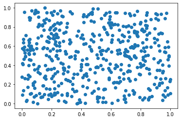
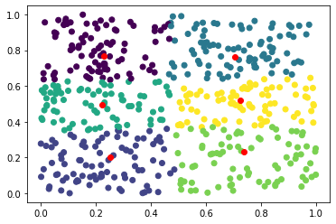
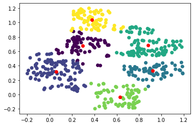
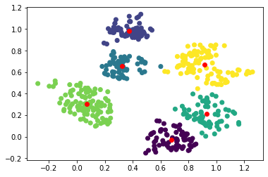
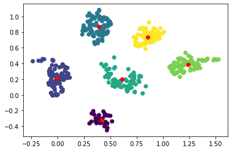

# torch-kmeans
 PyTorch implementation of soft K-means with adjustable parameters, allowing gradients to pass through the clustering algorithm.
 
A `SoftKMeans` clusterer object is initialied and then called like any other `torch.nn.Module`.

## Example usage

```
# Display points
p = torch.rand(500, 2)
plt.scatter(p.detach().numpy()[:, 0], p.detach().numpy()[:, 1])
plt.show()
```



```
# Use 
clusterer = SoftKMeans(6, scale=False, center=False)
assignments, cen = clusterer(p, True)

_, colours = assignments.max(dim=1)
plt.scatter(p.detach().numpy()[:, 0], p.detach().numpy()[:, 1], c=colours)
plt.scatter(cen.detach().numpy()[:, 0], cen.detach().numpy()[:, 1], c='red')
plt.show()

```



To show gradient propagation, our task will be to encourage clusters to be more distinct.

```
p.requires_grad = True

optimiser = torch.optim.RMSprop([p], lr=0.02)
model = SoftKMeans(6)

assignments, cen = model(p, True)

for i in range(10):
    
    _, colours = assignments.max(dim=1)
    plt.scatter(p.detach().numpy()[:, 0], p.detach().numpy()[:, 1], c=colours)
    plt.scatter(cen.detach().numpy()[:, 0], cen.detach().numpy()[:, 1], c='red')
    plt.show()
    
    loss = assignments.where(assignments < 0.1, 0).sum() - assignments.where(assignments > 0.6, 0).sum()
    loss.backward()
    optimiser.step()
    optimiser.zero_grad()
    
    assignments, cen = model(p, True)
```


Iteration 1:



Iteration 2:



Iteration 5:

